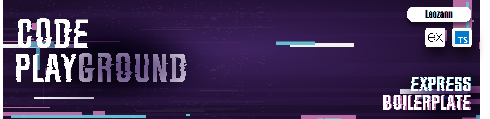

<div align="center">
  
<p align="center">
  
</p>
  
# Express + TypeScript Boilerplate
A modern, production-ready backend boilerplate designed for **small to medium applications**, internal engineering teams, and scalable enterprise level usage (non-microservice). Structured for clarity, long-term maintainability, and fast onboarding.

<!--  -->

### Built With

[![Express][Express.js]][Express-url] [![TypeScript][TypeScript.js]][TypeScript-url] [![Vitest][Vitest.js]][Vitest-url] [![PNPM][PNPM.js]][PNPM-url] [![Docker][Docker.js]][Docker-url] [![Drizzle][Drizzle.js]][Drizzle-url] [![PostgreSQL][Postgres.js]][Postgres-url]

This boilerplate eliminates the typical multi-day setup required for a clean, maintainable backend.  
Simply **clone → init → start building**

</div>

## &nbsp;

### 🧩 Key Features

- **Production-ready architecture**
- **App instance separated from entry point**
  - Serverless compatible
  - Test-friendly (supertest can load the app without starting a server)
- **Fully type safe end-to-end development**
- **Standardized API Response Format**
  - Unified success, list, and error structures
  - Built-in request id for easier tracing and debugging
- **Ready for Docker & local machine development**
- **Cross-platform support (Windows + macOS)**
- **Built-in code quality tools**
  - Pre-configured linting + formatting
  - Example unit tests included
- **Service Repository design pattern**
- **Fully Documented Codebase**
  - Root-level documentation for setup, usage, and architecture
  - Module-level READMEs for deeper explanations
  - Ensures fast onboarding and long-term maintainability

Built for interns, juniors, and mid-level developers, while remaining clean enough for larger-scale use.

## 📚 Table of Contents

- [Boilerplate Information](#express--typescript-boilerplate)
- [Why This Boilerplate?](#-why-this-boilerplate)
- [Usage Guide](#-usage-guide)
  - [Clone Repository](#-clone-instruction)
  - [Initial Setup](#-initial-setup)
  - [Docker Support](#-docker-support)
- [Architecture Overview](./src/README.md)
- [Database Guide](./src/database/README.md)
- [Contributors](#-contributors)


## 📌 Why This Boilerplate?

Modern backend engineering requires:
- Clear, enforceable structure
- Easy onboarding for new developers
- Predictable patterns
- Strong testing support
- Production-ready defaults
- Long-term maintainability

This repository addresses all of these points, providing a robust foundation for stable projects within your department and for public use.

## 🚀 Usage Guide

### 🧪 Clone Repository
Below are two ways to clone this repository depending on your preferred setup.
<details>
<summary>Show Instructions</summary>
<br>
Use this method if you prefer the simplest setup or don’t have SSH keys configured
<br>
&nbsp;

```sh
  # clone via https
  git clone https://github.com/Leozann/express-ts-boilerplate.git
```

Use this method if you already have SSH keys set up with GitHub. It provides a secure, password-less way to clone and push
&nbsp;

```sh
  # clone via ssh
  git clone git@github.com:Leozann/express-ts-boilerplate.git
```
</details>

### 🚧 Initial Setup
> [!IMPORTANT]
> The initial setup process is mandatory.

This repository provides an automated configuration script that handles all required preparations, ensuring the application is correctly initialized and aligned across all environments and team members.
<details>
<summary>Show Instructions</summary>
<br>
Run the following command once before starting development, staging, or production:
<br>
&nbsp;

```sh
  pnpm run init:setup
```
After installing dependencies, you can start the project in different modes using the following commands:
&nbsp;

```sh
  # development
  pnpm run dev

  # staging
  pnpm run staging

  # production
  pnpm run prod
```
If you want to enable the playground log while running in a local environment *_the log file is only created when **NODE_ENV=production**_, you can use the following command:
&nbsp;

```sh
  pnpm run prod:dev
```
Before running it, add this script to your package.json:
&nbsp;

```sh
  "prod:dev": "cross-env NODE_ENV=production tsx src/main.ts"
```
</details>

### 🐳 Docker Support
This boilerplate is fully **Docker-ready**, so you can start developing immediately without extra setup. Express automatically handles watch mode, so you can focus on the playground.
<details>
<summary>Show Instructions</summary>
<br>
This command builds the Docker images and starts all containers, including your application and database
<br>
&nbsp;

```sh
  docker compose up --build

```
Use this command to stop the Docker stack and remove the containers, while keeping your volumes and data
&nbsp;
```sh
  docker compose down
```
</details>

> [!NOTE]
> Useful information that developers should know.

1. Commit prevention is enforced:
   <br>
   **You cannot push without associated test files** — this improves code quality.
2. Recommended code editor: **VS Code** with:
   - ESLint
   - Prettier

## 🎭 Contributors


[Express.js]: https://img.shields.io/badge/Express-000000?style=for-the-badge&logo=express&logoColor=white
[Express-url]: https://expressjs.com
[TypeScript.js]: https://img.shields.io/badge/TypeScript-3178C6?style=for-the-badge&logo=typescript&logoColor=white
[TypeScript-url]: https://www.typescriptlang.org
[Vitest.js]: https://img.shields.io/badge/Vitest-6E9F18?style=for-the-badge&logo=vitest&logoColor=white
[Vitest-url]: https://vitest.dev
[PNPM.js]: https://img.shields.io/badge/PNPM-F69220?style=for-the-badge&logo=pnpm&logoColor=white
[PNPM-url]: https://pnpm.io
[Docker.js]: https://img.shields.io/badge/Docker-2496ED?style=for-the-badge&logo=docker&logoColor=white
[Docker-url]: https://www.docker.com
[Drizzle.js]: https://img.shields.io/badge/Drizzle%20ORM-1A1A1A?style=for-the-badge&logo=drizzle&logoColor=yellow
[Drizzle-url]: https://orm.drizzle.team
[Postgres.js]: https://img.shields.io/badge/PostgreSQL-4169E1?style=for-the-badge&logo=postgresql&logoColor=white
[Postgres-url]: https://www.postgresql.org


<!-- dummy -->

<!-- Please read this documentation so you can know deep dive exactly this repository have:

this boilerplate already include linter, unit testing, logger, limiter
please use vscode code editor only and install extensions ESLint and Prettier formatter
this setup ready-use for production purpose
this setup ready-use for docker environment, you can also use in local machine environment

---
A modern, production-ready Express + TypeScript boilerplate must separate the app instance from the entry point.
This pattern gives you:
Serverless compatibility (export the app without listening)
Testing-friendly (supertest can import the app without starting a server)
Cleaner structure (single responsibility: app config vs server startup)
Better maintainability for large teams (your internal department)
Good for public boilerplate (industry standard)
---

this repository using design pattern: service repository.
you can adjust based on needed. for micro-service please use another one

this boilerplate very type-safe for developer which give some benefit.
include
ZOD, eslint, husky and commit lint

in this project. no docker? no worries. we understand you. support cross platform (Win+Mac) no more headache

you should know/notice. this boilerplate is end-to-end type-safe for developer.
which you need to follow the best-practice in SDLC cycle

you cannot push the files into your repo if there is no testing file.
thats why we provide you example testing files -->

<!-- ## tools:

express
ts
vitest
pnpm
docker
drizzle
pg -->

<!-- contributor:
leozann
farhanlamiran -->

<!-- ## toc (table of content)

- boilerplate information
- Why this boilerplate?
- folder structure
- convention + linting (folder, file, code name)
- database structure folder (jump into database/readme)
- boilerplate usage
- tools installed
- contributor

tags(?) -->

<!-- ## folder structure -->
<!-- make it empty -->

<!-- ## clone

how to clone use https

how to clone use ssh

## usage -->

<!-- one script for automation -->
<!-- run this to make the project ready for running -->

<!-- pnpm run init:setup

then

pnpm dev for development
pnpm staging for staging
pnpm prod for production -->

<!--

# no need watch anymore because already have embed from express
docker compose up --build

docker compose logs -f

# kill docker
docker compose down -->

<!-- # Naming Conventions -->

<!-- make as table -->

<!-- Folder Naming
✔ Always plural
✔ Always lowercase
✔ Hyphens only for multi-word

All foundational (non-domain) modules go inside

for database schema use singular names
user.schema.ts
role.schema.ts

If complex domain: user/user.schema.ts

if you need to naming the file index, suffix. avoid index.ts inside many folders -->

<!-- <h1 align="center">
  <br>
  <a href="http://www.amitmerchant.com/electron-markdownify"></a>
  <br>
  Markdownify
  <br>
</h1> -->

<!-- <h4 align="center">A minimal Markdown Editor desktop app built on top of <a href="http://electron.atom.io" target="_blank">Electron</a>.</h4> -->


<!-- ## 📁 Folder Structure

```text
.
├── src/
│   ├── config/
│   ├── modules/
│   ├── utils/
│   └── app.ts
├── tests/
├── database/
└── ...
``` -->

<!-- - [Naming Conventions](#-naming-conventions) -->